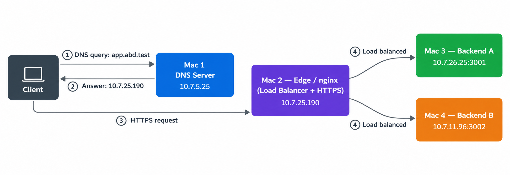

# Private Network Service Platform — Team ABD

**Course:** Computer Networks — Course Project  
**Phase:** Phase 1 (Build & Observe)  
**Infrastructure:** Type 1 — 4 physical macOS laptops on the same LAN  
**Domain:** `app.abd.test` / `api.abd.test`

## Overview

A private network service platform built on a local LAN with no cloud infrastructure. A client resolves `app.abd.test` through our private DNS server, connects over HTTPS to an nginx edge, and is load-balanced across two backend instances.

**Request flow:**  
`Client → DNS query (Mac 1) → HTTPS request (Mac 2 / nginx) → Backend A (Mac 3) or Backend B (Mac 4)`



## Team Members

| Enrollment No. | Name | Role | IP |
|----------------|------|------|----|
| 2401010089 | Anurag Pandey | Mac 1 — DNS server | `10.7.5.25` |
| 2401010385 | Ritik | Mac 2 — Edge / nginx | `10.7.25.190` |
| 2401010145 | Deepanshu Chaudhary | Mac 3 — Backend A | `10.7.26.25` |
| 2401010417 | Sarabjeet Singh | Mac 4 — Backend B + Test Client | `10.7.11.96` |

## Repository Structure

```text
team-abd-cn-project/
├── architecture/
│   └── topology-diagram.png        # Network topology diagram
├── backend-a/
│   └── server.js                   # Backend A (Port 3001, ETag header)
├── backend-b/
│   └── server.js                   # Backend B (Port 3002, ETag header)
├── config/
│   ├── dnsmasq.conf.snippet        # DNS resolver configuration
│   └── nginx.conf                  # Nginx SSL & load balancer configuration
└── evidence/
    ├── dig-output.txt              # DNS query outputs
    ├── curl-headers.txt            # Captured HTTP/HTTPS response headers
    └── wireshark-screenshots/      # Packet capture traces
```

## Quick Start & Reproduction

### 1. DNS Server (Mac 1 — `10.7.5.25`)
Apply rules from `config/dnsmasq.conf.snippet` to `dnsmasq.conf` and restart:
```bash
sudo brew services restart dnsmasq
```

### 2. Backends (Mac 3 & Mac 4)
- **Mac 3 (`10.7.26.25`):** `cd backend-a && node server.js` (Port 3001)
- **Mac 4 (`10.7.11.96`):** `cd backend-b && node server.js` (Port 3002)

### 3. Edge Reverse Proxy (Mac 2 — `10.7.25.190`)
Start Nginx with SSL and upstream load balancing using `config/nginx.conf`:
```bash
sudo nginx -c $(pwd)/config/nginx.conf
```

## Verification

Run from the client machine (Mac 4):

```bash
# 1. Test DNS resolution
dig @10.7.5.25 app.abd.test +short

# 2. Test HTTPS & load balancing (responses alternate between Backend A & B)
curl -i https://app.abd.test/api/status

# 3. Test caching headers (Cache-Control & ETag)
curl -I https://app.abd.test/
```

Captured logs and packet inspection screenshots are recorded in the `evidence/` directory.
